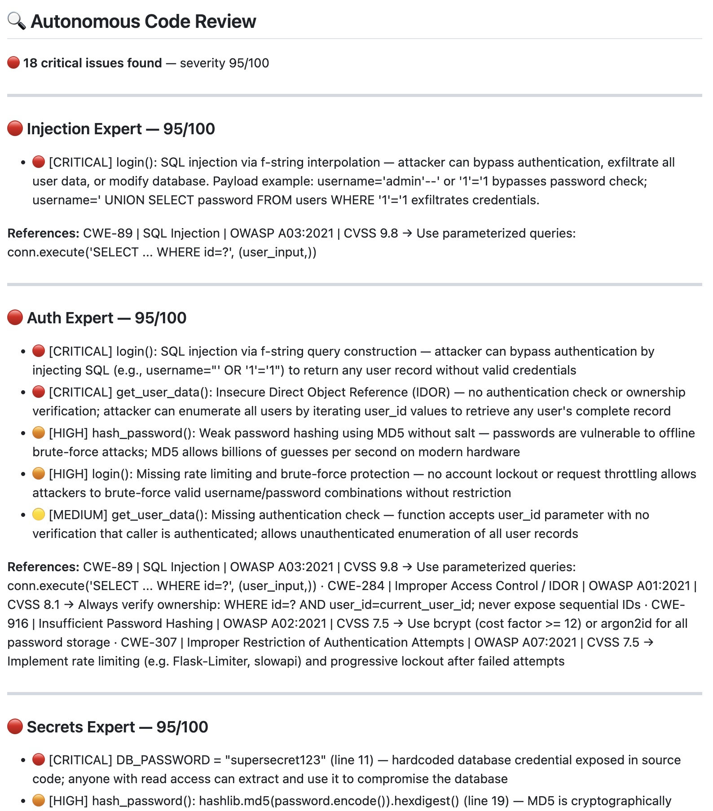
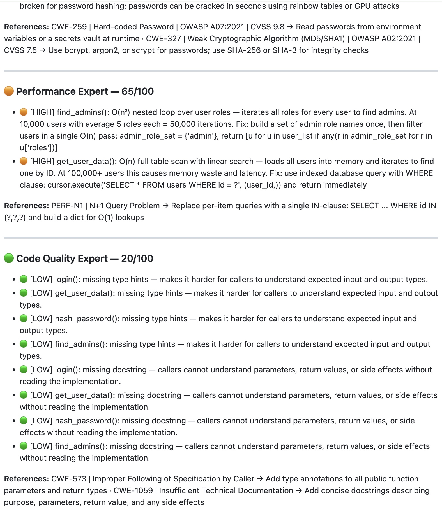
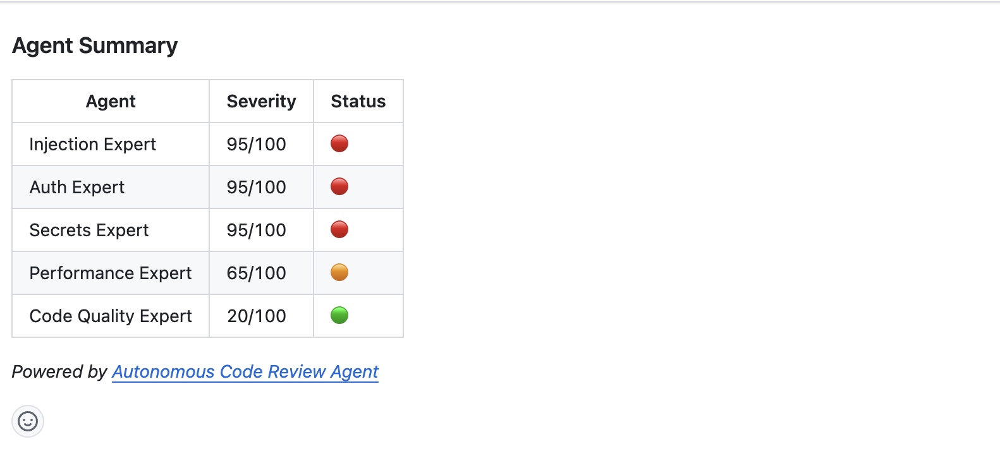

# Autonomous Code Review Agent

> Five AI specialists review every pull request in parallel — security vulnerabilities, performance issues, and code quality posted as a formal GitHub review within 10–15 seconds.

[](https://python.org)
[](https://anthropic.com)
[](https://openai.com)
[](https://langchain-ai.github.io/langgraph/)
[](LICENSE)

---

## What it does

Open a pull request → five specialist AI agents review it in parallel → a formal GitHub review is posted with inline comments on the exact diff lines where issues were found.

Comment `/fix` on any PR → the fix agent reads the stored findings and posts GitHub suggestion comments that you can apply with a single click.

**RAG-enriched findings:** every finding is matched against a CVE/CWE/OWASP knowledge base using vector similarity search (OpenAI embeddings + ChromaDB). Relevant references with remediation hints are attached directly to the review.

---

## The five review agents

| Agent | Model | What it looks for |
|-------|-------|-------------------|
| Injection Expert | Claude Haiku | SQL injection, XSS, SSTI, SSRF, path traversal, insecure deserialization, command injection |
| Auth Expert | Claude Haiku | Broken auth, IDOR, CSRF, missing rate limiting, privilege escalation |
| Secrets Expert | Claude Haiku | Hardcoded credentials, weak cryptography (MD5/SHA1), plaintext sensitive data |
| Performance Expert | Claude Haiku | O(n²) algorithms, N+1 queries, inefficient data structures, unbounded memory use |
| Code Quality Expert | GPT-4o Mini | Naming, type hints, SRP violations, cognitive complexity, documentation |

Each finding uses the format `[SEVERITY] function(): issue — concrete impact` where severity is `CRITICAL`, `HIGH`, `MEDIUM`, or `LOW`.

---

## Demo

[](https://youtu.be/TySXlmJw6hA)

---

## Example review







> 💬 Comment `/fix` on the PR to get inline fix suggestions you can apply with one click.

---

## Setup

### 1. Deploy to Vercel

[](https://vercel.com/new/clone?repository-url=https%3A%2F%2Fgithub.com%2FGUST050%2Fautonomous-code-review-agent&env=ANTHROPIC_API_KEY,OPENAI_API_KEY,GITHUB_TOKEN,GITHUB_WEBHOOK_SECRET&envDescription=API+keys+for+LLM+providers+and+GitHub+integration&project-name=code-review-agent&repository-name=autonomous-code-review-agent)

| Variable | Where to get it |
|----------|----------------|
| `ANTHROPIC_API_KEY` | [console.anthropic.com](https://console.anthropic.com) |
| `OPENAI_API_KEY` | [platform.openai.com](https://platform.openai.com) — used for Code Quality agent and RAG embeddings |
| `GITHUB_TOKEN` | GitHub → Settings → Developer settings → Personal access tokens → Generate new token (classic). Required scopes: `repo` |
| `GITHUB_WEBHOOK_SECRET` | Any random string — you'll use the same value when configuring the webhook on GitHub |

### 2. Add the webhook to your repository

In the GitHub repository you want reviewed, go to **Settings → Webhooks → Add webhook**:

- **Payload URL:** `https://your-deployment.vercel.app/api/webhook`
- **Content type:** `application/json`
- **Secret:** the same value you used for `GITHUB_WEBHOOK_SECRET`
- **Which events:** select **Let me select individual events**, then check:
  - ✅ Pull requests
  - ✅ Issue comments

Click **Add webhook**. GitHub sends a ping — a green checkmark means it's working.

---

## Usage

**Automatic review on every PR**

Open a pull request or push new commits. Within 10–15 seconds a formal review appears with:
- Findings listed per agent with severity tags
- CVE/CWE/OWASP references and remediation hints for each finding
- Inline comments placed directly on the affected diff lines

**Auto-fix with `/fix`**

Comment `/fix` on the PR. The fix agent:
1. Reads the findings stored in the previous review (no database needed)
2. Fixes each affected function independently in parallel
3. Posts inline GitHub suggestion comments — click **Commit suggestion** on each fix to apply it
4. Functions outside the diff are shown as collapsible copy-paste blocks

---

## Local CLI

```bash
git clone https://github.com/GUST050/autonomous-code-review-agent.git
cd autonomous-code-review-agent

python -m venv venv && source venv/bin/activate
pip install -r requirements.txt

cp .env.example .env
# Add your API keys to .env

# Review a specific file
python src/main.py --file path/to/file.py

# Review your uncommitted git changes
python src/main.py --diff

# Review and generate fixes
python src/main.py --file path/to/file.py --fix

# CI mode — exits 1 if severity >= 80
python src/main.py --file path/to/file.py --ci

# Run tests (312 tests)
venv/bin/pytest tests/
```

---

## Environment variables

```env
# LLM providers
ANTHROPIC_API_KEY=sk-ant-...   # Injection, Auth, Secrets, Performance agents + Fix generator
OPENAI_API_KEY=sk-...          # Code Quality agent (GPT-4o Mini) + RAG embeddings (text-embedding-3-small)

# GitHub
GITHUB_TOKEN=ghp_...           # PAT with repo scope — for fetching diffs and posting reviews
GITHUB_WEBHOOK_SECRET=...      # Arbitrary secret for HMAC-SHA256 webhook signature validation

# LangSmith (optional — enables tracing at smith.langchain.com)
LANGSMITH_API_KEY=lsv2_...
LANGSMITH_TRACING=true
LANGSMITH_PROJECT=autonomous-code-review
```

---

## Architecture

```
GitHub webhook
      │
      ▼
api/webhook.py  (Vercel serverless, maxDuration=300s)
      │
      ├── pull_request (opened / synchronize / reopened)
      │         │
      │         ├── Fetch diff + PR metadata + changed files  (3 parallel GitHub API calls)
      │         ├── Fetch file contents                       (N parallel GitHub API calls)
      │         │
      │         ▼
      │   ThreadPoolExecutor — all agents × all files run simultaneously
      │   ┌─────────────────────────────────────────────────────────┐
      │   │  Per agent, before LLM call:                            │
      │   │    _rag_context() — parallel embedding queries →        │
      │   │    inject CVE/CWE patterns into prompt                  │
      │   │                                                         │
      │   │  InjectionAgent  AuthAgent  SecretsAgent                │
      │   │  PerformanceAgent  QualityAgent                         │
      │   └─────────────────────────────────────────────────────────┘
      │         │
      │         ▼
      │   RagEnricher — attach CVE/CWE/OWASP references to findings
      │         │
      │         ▼
      │   Post one formal PR review:
      │     • Summary in review body (with hidden base64-encoded findings)
      │     • Inline comments on the exact diff lines where issues were found
      │
      └── issue_comment (body contains "/fix")
                │
                ├── Decode findings from hidden comment in last review body
                ├── Fetch current file contents
                │
                ▼
          FixGeneratorAgent
            • split_code() — parse into header + one section per function
            • Fix each affected function in parallel (ThreadPoolExecutor)
            • Fix header last (merge new imports, remove hardcoded secrets)
            • Post inline GitHub suggestion comments on diff lines
            • Functions outside the diff → collapsible copy-paste blocks
```

**LangGraph visualisation:** The full agent graph is defined in `src/graph/review_graph.py` and can be opened in [LangGraph Studio](https://github.com/langchain-ai/langgraph-studio) to visually explore the flow — nodes, edges, fan-out, and state transitions. The production execution path uses `ThreadPoolExecutor` directly for true parallelism, but the graph definition serves as living architecture documentation.

**How findings persist without a database:** After each review, all findings are serialized as JSON, base64-encoded, and embedded in a hidden HTML comment inside the PR review body. When `/fix` is triggered, the agent decodes them directly from GitHub — no external storage needed.

**Code slicing:** Each agent only sees the functions relevant to its domain. The Injection Expert skips `hash_password()` and `find_admins()`; the Performance Expert skips pure-auth functions. This reduces token usage and noise.

---

## Cost

| Operation | Typical cost |
|-----------|-------------|
| PR review (5 agents + RAG) | ~$0.003–$0.010 |
| `/fix` command (Sonnet) | ~$0.01–$0.05 |
| RAG embeddings per review | ~$0.00002 |

Cost scales with diff size. A large PR with many changed files costs proportionally more.
